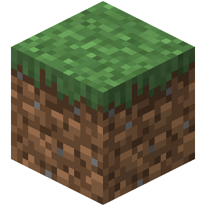

class: middle

<h1>Roblox</h1>

### Introduction

#### &copy; Mikaël Ruffieux, 07.2021

---

## Qui est en face de vous ?

<table class="unstyled-table">
  <tr>
    <td style="width: 50%;">
      <h3>Mikaël Ruffieux</h3>
      J'ai 25 ans  
      J'habite à <b>Epagny</b> et à <b>Neuchâtel</b>  
      <b>Ingénieur</b> des Médias à la HEIG-VD  
      Mes hobbies : le <b>vélo</b> et la <b>vidéo</b>  
      Mon jeu vidéo préféré : <b>Minecraft</b>
    </td>
    <td style="width: 50%;">
      
      
      
    </td>
  </tr>
</table>

---
class: middle

## Qui êtes-vous ?

- Présentez-vous à la classe (votre nom, où vous habitez, où vous allez à l'école, votre jeu vidéo préféré, vos hobbies, etc.)

---
class:middle

# Déroulement du cours

- Le cours commence à **14h00**, et se termine à **16h00** ;

- La visioconférence sera lancée vers **13h55** ;

- Nous ferons une pause de **15 minutes** vers 15h ;

---
class:middle

# Programme du cours

1. Présentation de Roblox Studio

2. Création de 4 mini-jeux *(selon le temps à disposition)*

3. Création de votre projet libre

<b>Compétences</b>

- Introduction à la création de jeux vidéos

- Introduction à la création d'univers en 3D

- Introduction au langage de programmation *Lua*

*Remarque : toutes les slides du cours sont disponibles à l'adresse suivante : [https://github.com/futurekids-io/](https://github.com/futurekids-io/)*

---
class:middle

## Vous avez  des questions ? 

<!-- ################ Fin de la présentation ################### -->