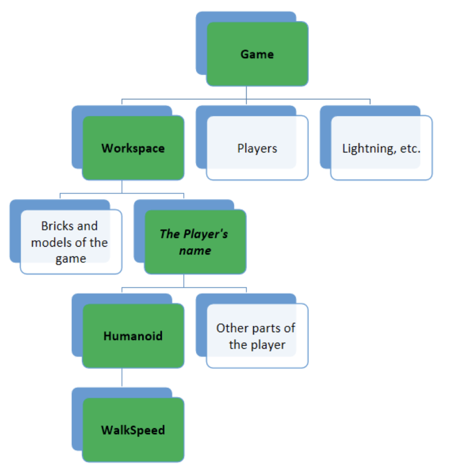

class: middle

<h1><span class="secondary-color main-title">Roblox</span></h1>

### Cours 1

#### &copy; Mikaël Ruffieux, 04.2021


---

## Connaissez-vous <br/><span class="secondary-color">Roblox</span> ?

- Qui d'entre vous connait le jeu **Roblox** ?

- À quoi comme jeu jouez-vous autrement ? 

***

- Et qui d'entre vous connait **Roblox Studio** ?

- Connaissez-vous d'autres outils de création de jeux vidéos ?

???

Unreal Engine, Unity, LÖVE (utilise aussi Lua), CryEngine (Far Cry) 

---

## Connaissez-vous <br/><span class="secondary-color">Roblox</span> ?

- Qui d'entre vous connait le jeu **Roblox** ?

- À quoi comme jeu jouez-vous autrement ? 

***

- Et qui d'entre vous connait **Roblox Studio** ?

- Connaissez-vous d'autres outils de création de jeux vidéos ?

<br/>

*Unreal Engine, Unity, LÖVE (utilise aussi Lua), CryEngine (Far Cry)*

---

## <span class="secondary-color">Roblox</span>

- Jeu vidéo gratuit pour **enfants** et **adolescents**, créé en 2004 par David Baszucki

- Plusieurs millions d'utilisateurs

- Avantage de ce jeu : **Roblox Studio**

- Ce programme vous permet de créer vos propres jeux en utilisant le langage de programmation *Lua*

- Vous pouvez, une fois votre jeu terminé, le publier sur le site de Roblox, où tout le monde peut y jouer !

<div style="text-align:center;">
    
</div>

---

# Démarrage de <span class="secondary-color">Roblox Studio</span>

- Si vous avez déjà un compte Roblox, notez votre nom d'utilisateur et votre mot de passe

- Rendez-vous ensuite sur la page : https://www.roblox.com/login

- Pour les personnes n'ayant pas encore de compte, cliquez sur "S'inscrire", en haut à droite

- *Facultatif : vous pouvez m'ajouter en ami, en recherchant "rdX_TheArrow", dans "Joueurs"*

- Quand vous avez votre compte, avec nom d'utilisateur et mot de passe, ouvrez sur votre ordinateur l'application **Roblox Studio**


---

# Roblox Studio : <span class="secondary-color">Accueil</span>


???

Interface en anglais, quel est le niveau de la classe ? 

Choix entre des mondes "pré-faits"

Pour l'exemple : "City"

---

# Roblox Studio : <span class="secondary-color">Interface</span>


---

# Roblox Studio : <span class="secondary-color">Interface</span>

<div style="text-align:center;">
    
</div>

- "Tools" : Outils pour sélectionner, redimentionner, faire pivoter un/des objets, gérer les collisions

- "Terrain/Insert" : Outils permettant d'ajouter du terrain, des objets, de gérer l'interface utilisateur du jeu, modifier les matériaux et couleurs des objets

- "Test" : Boutons pour démarrer/arrêter/mettre en pause le jeu, ainsi qu'un bouton pour gérer les paramètres du projet

???

Fermer "Toolbox" et "Terrain editor"

---

# Roblox Studio : <span class="secondary-color">Interface</span>

<div style="text-align:center;">
    
</div>

- "Explorer" : contient tous les éléments présents dans le jeu

- "Properties" : contient les propriétés de l'objet sélectionné (position, angle de rotation, etc.)

- "City" *(zone centrale)* : Espace de travail où ajouter tous les objets qui seront présents dans la scène

---

# Se déplacer dans <br/> notre <span class="secondary-color">scène</span>

Essayez les actions suivantes : 

- Zoom avant / zoom arrière *(molette)*

- Mouvements verticaux et horizontaux *(clic de molette)*

- Faire pivoter la caméra *(clic droit)*

Le **clic gauche** sert à sélectionner des objets dans la scène.

---

# <span class="secondary-color">Tester</span> votre scène

Appuyez sur le bouton "Play", et explorez ce petit monde !

Pour vous déplacer : 

- WASD ou les flèches pour bouger

- Clic droit pour bouger votre caméra

- Espace pour sauter

---

# Ajouter des <span class="secondary-color">objets</span>

Pour mieux s'y retrouver, nous allons créer un nouveau dossier :

en haut à droite, cliquez sur le "+" > "Folder" > le renommer en "Deco".

### Spawn point

Pour éviter que notre personnage n'apparaisse au milieu du ciel, nous allons créer un **point d'apparition** :

Onglet "Model" > "Gameplay" > "Spawn" *(icone de "soleil")*

Pour le **déplacer**, cliquez sur le bouton "Move", en haut à gauche.

Dans la fenêtre "Properties", il est possible de **modifier la couleur** du point d'apparition.

???

Une flèche par dimension : 3D, x-y-z

---

# Ajouter des <span class="secondary-color">objets</span>

Si vous êtes perdu dans votre plan de travail *(ce qui arrive assez souvent)*, vous pouvez cliquer sur un objet de la fenêtre "Explorer", et appuyer sur **la touche F**.

### Objets simples

Pour créer des objets simples, il vous suffit de : 

Dans "Insert", cliquez sur "Part", et choisissez votre **objet à créer**.

Vous pouvez ensuite modifier cet objet grâce aux outils de la zone "Tools" :
- Select *(pour sélectionner l'objet)*
- Move *(pour le déplacer)*
- Scale *(pour le redimensionner)*
- Rotate *(pour le faire tourner)*

Dans les propriétés de l'objet, vous pouvez cocher ou décocher l'option "CanCollide", pour **modifier les collisions** avec les autres objets et le joueur *(nous utiliserons plus tard cette fonctionnalité)*.

???

Défi : créer un garage aérien pour la voiture : création du garage et d'une rampe d'accès

---
class:middle, center

# Exercice <span class="secondary-color">pratique</span> 
### Créons un garage pour notre voiture à l'abris !

---

# Ajouter des <span class="secondary-color">modèles Roblox</span>

Pour ne pas devoir tous les objets de zéro, comme notre garage, Roblox et ses utilisateurs mettent à disposition **tous les objets** qu'ils ont déjà créés, et vous pouvez vous aussi les utiliser via la "Toolbox".

**Remarques** : certains objets sont payants, et si vous les utilisez, vous aurez un message vous demander de payer. 
Pour éviter cela, ajoutez principalement les objets ayant ce logo :


---

# Modifier votre <span class="secondary-color">personnage</span>

Pour que chacun puisse avoir un personnage unique, nous allons modifier le personnage de base.

Pour cela, cliquez sur l'onglet "Plugins", puis sur "Build Rig".

<div style="text-align:center;">
    
</div>

La différence entre **R15** et **R6** est le nombre de parties composant le corps du personnage. Nous allons utiliser le R15.

---

# Modifier votre <span class="secondary-color">personnage</span>

Voici à quoi ressemble chacun des modèles : 

<div style="text-align:center;">
    
</div>

---
class:middle, center

# Exercice <span class="secondary-color">pratique</span> 
### Personnalisez votre personnage !

???
Insertion des ailes

---
# Modifier votre <span class="secondary-color">personnage</span>

Si l'on appuie sur "Play" maintenant, nous verrons le personnage que nous avons créer flotter en l'air, et notre personnage sera toujours le même ...

Pour modifier notre personnage jouable, il faut glisser notre nouveau personnage dans le dossier "StarterPlayer" de la zone "Explorer", et le renommer "StarterCharacter".

Avant d'appuyer sur "Play", il faut encore activer le mouvement de l'objet. Pour cela, décocher l'option "Anchored" de la partie "HumanoidRootPart" de notre objet.

---

# Enregistrer votre <span class="secondary-color">personnage</span>

Pour sauvegarder votre tout nouveau personnage, faites un clic droit sur l'objet "StarterCharacter", puis cliquez sur "Save to Roblox...", et finalement "Submit".

Vous pouvez à présent le retrouver dans votre "Toolbox", dans l'onglet "My Models".

---

# Vos premiers <span class="secondary-color">scripts</span>

Qui n'a jamais rêvé de modifier des fonctionnalités de base d'un jeu ? Voler dans les airs, respirer sous l'eau, faire des supers sauts ...

Ici, c'est votre jeu, vous faites ce que vous voulez !

### Trouver les paramètres de votre personnage

- Lorsqu'on appuie sur "Play", notre personnage apparaît dans le "Workspace"

- En cliquant sur "Humanoid", on découvre les propriétés de notre personnage

-  Dans l'onglet "Game", vous pouvez augmenter **votre vitesse**, en modifiant le paramètre "WalkSpeed"

- Essayez vous-mêmes de modifier les attributs de votre personnage : "WalkSpeed" et "JumpPower"

---

# Vos premiers <span class="secondary-color">scripts</span>

<table>
    <tr>
        <td style="width:50%;">
            Avant de créer des "vrais" scripts, nous pouvons les tester en direct grâce à la <b>ligne de commandes</b>
            <br/><br/>
            Un <b>script</b> ou un programme informatique, c’est un moyen pour nous êtres humains, de pouvoir <b>dire à l’ordinateur</b> d’exécuter des calculs et donc de faire des choses.
            <br/><br/>
            Pour modifier notre vitesse avec une commande, nous allons donc <b>retracer tout le chemin</b> que nous avons nous-mêmes fait dans l'explorateur, et modifier la valeur du paramètre de la vitesse.
        </td>
        <td style="width:50%;">
            
        </td>
    </tr>
</table>

---
class:middle, center

# Exercice <span class="secondary-color">pratique</span> 
### Créez la commande pour modifier la couleur de votre garage

**Indice** : la valeur de votre couleur se définit comme ceci :
```lua
cheminVersLObjet = BrickColor.VotreCouleur()
```

---

# Vos premiers <span class="secondary-color">scripts</span>

La commande pour modifier votre garage : 

```lua
workspace.Garage.BrickColor = BrickColor.Green()
```

Pour créer une couleur aléatoire à chaque fois :

```lua
workspace.Garage.BrickColor = BrickColor.Random()
```

*Random signifie "aléatoire" en anglais.*

---
# <span class="secondary-color">Sauvegarder</span> votre projet

Pour **enregistrer** votre projet, cliquez sur "File", en haut à gauche.

Sélectionnez ensuite "Save to Roblox as..." > "Create new game..." > Donnez un nom à votre projet > "Create"

Et voilà, tout le monde peut maintenant jouer à **votre jeu** !

---
class:middle, center

# À demain, en <span class="secondary-color">pleine forme</span>