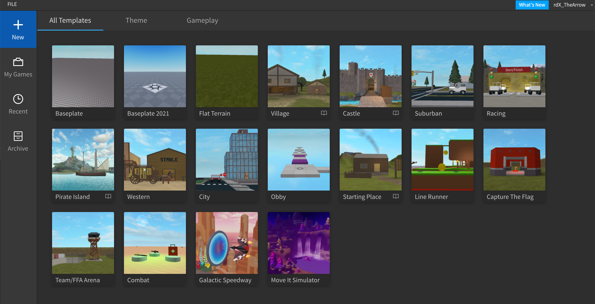

class: middle

<h1>Roblox</h1>

### Cours 2

#### &copy; Mikaël Ruffieux, 04.2021

---

# Programme du  jour

Création du jeu **"Course contre-la-montre"**

Vous pouvez essayer le jeu en visitant le profile de FutureKids : [BabockFee](https://www.roblox.com/games/6087348894/Race-against-time-II)

---

# Initialisation du projet

Pour commencer à créer notre projet, nous utiliserons le modèle "Baseplate".

---

# Le terrain

Dans la zone "Terrain", cliquez sur "Editor".

Pour générer automatiquement un terrain, nous cliquons sur **"Generate"**.

- **"Map Settings"** indique la **position** et la **taille** du terrain généré.

- **"Material Settings"** permet de sélectionner quels **types de terrain** l'on souhaite intégrer à notre carte. Ces types de terrain sont appelés **"biomes"**. Vous pouvez en choisir **3-4** parmis les suivants : 

    - Water : eau / marsh : marais / plains : plaines / hills : collines / dunes / canyons / mountains : montagnes / lavascape : champs de lave / arctic : paysage arctique.
    - L'option **"Biome Size"** permet de définir la taille des différents biomes sur notre terrain entier. *(Ne choisissez pas une taille trop grande, sinon un biome prendra toute la place, une valeur entre 50 et 100 permet une bonne diversité)*
    - L'option **"Caves"** définit si des grottes seront créées dans le sol.

- Si ce dernier ne vous convient pas, vous pouvez modifier les paramètres, et appuyer à nouveau sur **"Generate"**.

---

# Préparer le terrain pour notre jeu

Afin d'éviter d'avoir un gros carré au milieu de notre terrain, n'oubliez pas de supprimer l'objet **"Baseplate"**.

Pour notre jeu, nous voulons un terrain particulier : très peu épais, mais assez grand pour pouvoir s'y balader.

Pour cela, nous allons modifier les paramètres "Size", dans "Map Settings" : 

- X : 700
- Y : 100
- Z : 700

Choissisez **3-4 biomes**, à l'exception de : *Water*, *Canyons* et *Mountains*.

Il est parfois tentant de mettre de très grandes valeurs, pour être sûr.e d'avoir assez de place pour travailler, mais **plus votre terrain sera grand, plus il sera "lourd" pour votre ordinateur**, et il faudra beaucoup de temps pour faire chaque modification.

---

# Personnaliser le terrain

Ajoutons maintenant à la main une petite rivière

- Dans l'onglet **"Edit"**, sélectionnez l'outil **"Paint"**;

- Pour modifier la largeur de la rivière, vous pouvez modifier le paramètre **"Base Size"**;

- Dans **"Material Settings"**, sélectionnez **"Water"**;

- Vous pouvez maintenant **peindre** votre rivière sur votre carte !

*Si vous faites une erreur, vous pouvez toujours revenir en arrière avec les touches Ctrl+Z*

---
# Personnaliser le terrain

Ajoutons aussi quelques collines :

- Dans l'onglet **"Edit"**, sélectionnez cette fois l'outil **"Grow"**;

- En maintenant votre clic gauche, le terrain va "gonfler", pour créer des collines;

- À l'inverse, l'outil **"Erode"** va creuser le terrain.

???

10' pour faire leurs modifications

---

# Personnaliser le terrain

<table>
    <tr>
        <td style="width:50%;">
            Si l'on clique sur "Workspace" > "Terrain", on voit apparaître les différentes options ci-contre :
              
            L'option "Decoration" permet d'activer les brins d'herbes sur votre terrain.
              
            Nous pouvons ici modifier la couleur de l'eau, en modifiant "WaterColor".
              
            En ouvrant "MaterialColors", vous voyez s'afficher tous les matériaux utilisés dans votre terrain. Vous pouvez ici aussi les personnaliser et changer leurs couleurs.
        </td>
        <td style="width:50%; text-align: center;">
            
        </td>
    </tr>
</table>

---
class: middle

# Exercice pratique
### Créez un point d'apparition <i>(SpawnPoint)</i>, et insérer dans ce monde le personnage créé hier.

*Petit indice : le point d'apparition est rangé dans l'onglet "Model", et votre personnage est dans votre "Toolbox".*

---
# Création de variables

Tout d'abord, savez-vous ce qu'est **une variable** ? 

---
# Création de variables

Tout d'abord, savez-vous ce qu'est **une variable** ? 

<blockquote>
    Une variable peut avoir de très nombreuses utilités, c’est un élément dont <b>on peut changer la valeur</b> quand on le désire. 
      
    Par exemple, dans certains jeux Mario, on a 3 coeurs pour représenter la vie du personnage… Si on touche un danger, on perd un coeur, donc en gros, on diminue notre vie de 1. 
      
    Les variables peuvent être de <b>plusieurs types</b>, dans l’exemple ci-dessus ce sont des nombres, mais les variables peuvent aussi contenir des lettres, ou des objets !
</blockquote>

---
# Création de variables

Ici, nous allons créer 2 variables, qui seront des nombres entiers (1, 2, 50, 144, ...), en anglais *Integer*.

En cliquant sur le "+", à côté de "Workspace", nous pouvons ajouter un élément **"IntValue"**.

Nos deux variables : 

- *NumberOfEnergySphereLeft* : le nombre de sphères restant sur le terrain;

- *Points* : le nombre de points que le joueur aura marqué.

*Remarque: vous pouvez nommer vos variables comme vous voulez, mais leurs noms doivent être compréhensible pour quelqu'un qui découvrirait votre programme. Par soucis de simplicité, et pour éviter d'oublier le nom des variables **nommez-les comme moi** ;)*

---

# Création de variables
### Les EnergySphere

Les *EnergySphere* seront les objets à ramasser pour marquer des points. En plus de cela, à chaque nouvelle sphère, le joueur pourra courir un peu plus vite.

Pour créer nos *EnergySphere* :

- Créez une nouvelle **sphère** *("Part" > "Sphere")*;

- La **renommer** en *EnergySphere*;

- Ajoutons **un effet** pour la rendre plus visible : 

    - "Model" > "Effects" > "Fire" *(mais vous pouvez en choisir un autre : Smoke, Sparkle, Particle ...)*

- Vous pouvez **modifier l'apparence de votre sphère**, et de **votre effet** dans les propriétés de ces derniers.

---

# Les scripts

(p. 54 du Manuel)