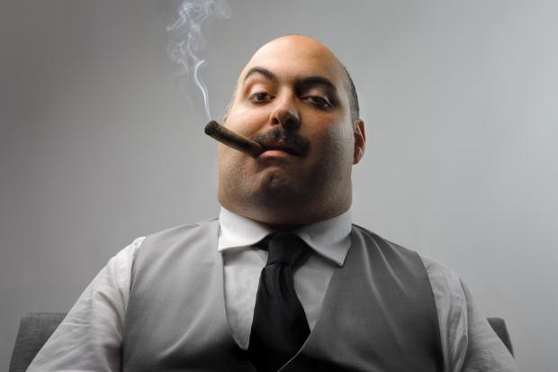

class: middle

<h1>Roblox</h1>

### Projet libre

#### &copy; Mikaël Ruffieux, 04.2021

---

# Le maître-mot : créativité

Dans la première partie de l'exercice, je mets ma casquette de **patron**, et à vous de me convaincre que votre jeu peut être développé.

- Commencez par **planifier** votre jeu sur papier :

    - Décrivez le **but** du jeu
    - Listez les **interactions** que votre personnage aura avec l'environnement
    - Besoin d'une **UI** *(système de points, menu, etc.)* ?
    - Schéma de la **carte**, avec les objets que vous y placerez

- Une fois le projet validé, **au travail** ! 

    

---
class:middle

# Fin du cours

- Comment s'est passée cette semaine pour vous ?

- Qu'est-ce que vous avez le **mieux** aimé ? 

- Qu'est-ce que vous avez le **moins** aimé ?

- Qu'est-ce que vous aimeriez apprendre dans un **futur cours** ?

---
class: middle

<h1>Bonne suite,  et bon jeu !</h1>

